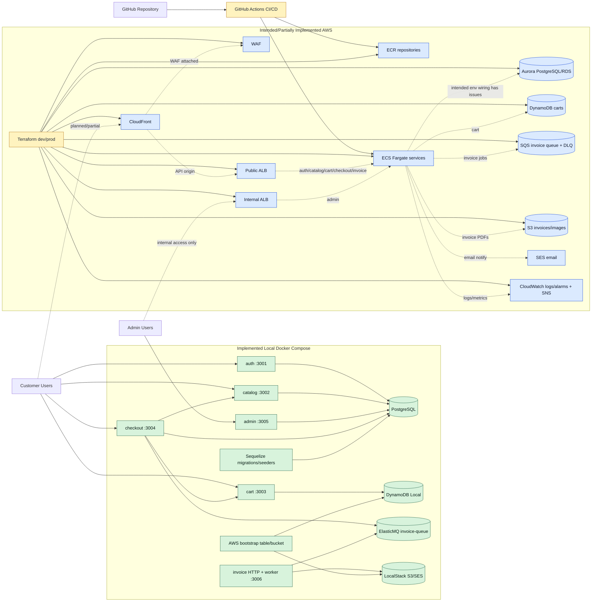

# ShopCloud Code-Based Technical Analysis

This analysis is based on the repository contents under `C:\Users\Bassam\git\ShopCloud` as inspected on 2026-05-01. It intentionally separates implemented code from scaffolded or planned architecture. The PDFs in the repository were not used as implementation evidence.

## 1. Executive Summary

ShopCloud is a lightweight e-commerce backend implemented as six Node.js/Express microservices: `auth`, `catalog`, `cart`, `checkout`, `admin`, and `invoice`. Locally, the system runs with Docker Compose and uses PostgreSQL for users, products, categories, and orders; DynamoDB Local for carts; ElasticMQ as an SQS-compatible queue; and LocalStack for S3/SES-style invoice infrastructure.

The implemented runtime supports customer registration and login, JWT-protected cart operations, public product browsing, checkout with stock validation, order creation, asynchronous invoice job publishing, PDF invoice generation, S3 upload, and admin management APIs. There is no frontend UI.

The repository also contains Terraform and GitHub Actions files for an intended AWS deployment using ECS/Fargate, ECR, Aurora PostgreSQL/RDS, DynamoDB, SQS, S3, CloudFront, WAF, ALB, IAM, and CloudWatch. Those files are more than empty placeholders, but the AWS deployment path is only partially aligned with the application code. Several Terraform environment variable names do not match what the services read, AWS database migrations are not automated, the deploy health-check URLs do not match service routes, and some networking/OIDC settings appear incomplete or incorrect.

## 2. Repository Structure

| Path | Purpose | Implementation status |
|---|---|---|
| `services/` | Contains the six Express services. Each service has its own `package.json`, `Dockerfile`, `.env.example`, and `src/` code. | Implemented for local runtime. No automated tests. No frontend. |
| `services/auth/` | Customer and admin login/registration service. | Implemented. Uses PostgreSQL and JWT. |
| `services/catalog/` | Public product/category APIs and admin product/category APIs. | Implemented. Uses PostgreSQL. Includes an internal stock-decrement route protected only by a static header. |
| `services/cart/` | JWT-protected cart APIs backed by DynamoDB-compatible storage. | Implemented. Uses DynamoDB Local in Compose and intended DynamoDB in AWS. |
| `services/checkout/` | Creates orders, validates stock through catalog, clears carts, publishes invoice jobs. | Implemented locally. Has consistency/security limitations. |
| `services/admin/` | Admin-only product, order, and user management APIs. | Implemented as an API service. No admin UI. Docker exposes it locally on port `3005`. |
| `services/invoice/` | HTTP invoice generation endpoint plus SQS long-poll worker in the same process. Generates PDFs, uploads to S3, sends SES email. | Implemented locally with LocalStack/ElasticMQ. Email errors are logged and swallowed. |
| `database/` | Sequelize migrations and seeders for PostgreSQL. | Implemented for local Docker Compose/manual use. Not automated for AWS deployment. |
| `docker-compose.yml` | Local orchestration for infrastructure containers, bootstrap jobs, migrations, and all services. | Implemented. Some services can start before migrations/bootstrap complete. |
| `elasticmq.conf` | Defines the local SQS-compatible `invoice-queue`. | Implemented. |
| `infrastructure/terraform/` | Terraform modules and `dev`/`prod` environments for AWS. | Partially implemented. It defines many AWS resources but has important application/config mismatches. |
| `infrastructure/monitoring/` | Contains `alarms/` and `dashboards/` directories. | Scaffold only; both contain only `.gitkeep`. CloudWatch alarms are instead in Terraform under `modules/monitoring`. |
| `.github/workflows/` | CI and AWS deploy workflows. | Implemented as YAML workflows, but AWS deploy assumes already-provisioned infrastructure and has route/config issues. |
| `shared/middleware/auth.js` | Shared JWT middleware copy. | Scaffolded/unused. Services use their own duplicated middleware files. |
| `README.md`, `DEPLOYMENT_CHECKLIST.md`, PDFs | Documentation/planning material. | Useful context, but not authoritative. Some statements are stale or overstate AWS readiness. |

## 3. Microservices Breakdown

### Auth Service

- Path: `services/auth/`
- Port: `3001`
- Entry points: `src/server.js`, `src/app.js`
- Main routes: `services/auth/src/routes/auth.js`
- Database: PostgreSQL through Sequelize in `src/db.js`
- Public-facing locally: yes
- AWS intent: ECS/Fargate service behind public ALB route `/auth*`

Implemented routes:

| Method | Path | Code evidence | Behavior |
|---|---|---|---|
| `POST` | `/auth/register` | `services/auth/src/routes/auth.js` | Validates email/password/name, checks duplicate user, hashes password with `bcrypt.hash(password, 12)`, creates a user, returns JWT. |
| `POST` | `/auth/login` | same file | Finds customer by email, compares bcrypt hash, returns JWT. |
| `POST` | `/auth/admin/login` | same file | Finds admin in `admin_users`, compares bcrypt hash, returns JWT with `isAdmin: true` and `role`. |
| `GET` | `/auth/me` | same file | Requires JWT, returns current user/admin profile. |
| `POST` | `/auth/logout` | same file | Stateless response only; no server-side token invalidation. |
| `GET` | `/health` | `services/auth/src/app.js` | Authenticates Sequelize connection and returns service health. |

Environment variables:

- `PORT`
- `DB_HOST`, `DB_PORT`, `DB_NAME`, `DB_USER`, `DB_PASS`
- `JWT_SECRET`
- `JWT_EXPIRES_IN`
- `NODE_ENV`

Important details and limitations:

- JWT payloads use `userId`, `email`, and `isAdmin`.
- Tokens are signed in `signToken()` in `services/auth/src/routes/auth.js`.
- Passwords are hashed with bcryptjs.
- There is no refresh-token flow, token revocation list, password reset, rate limiting, or account lockout.
- Admin authentication is handled by this same service, but admin authorization is enforced separately by admin/catalog middleware.

### Catalog Service

- Path: `services/catalog/`
- Port: `3002`
- Main routes: `services/catalog/src/routes/products.js`, `services/catalog/src/routes/categories.js`
- Database: PostgreSQL
- Public-facing locally: yes
- AWS intent: ECS/Fargate behind public ALB routes `/products*`, `/categories*`, and `/catalog*`

Implemented product routes:

| Method | Path | Behavior |
|---|---|---|
| `GET` | `/products` | Public list with optional `q`, `category`, `page`, and `limit`. Uses PostgreSQL `iLike` search and category slug lookup. |
| `GET` | `/products/search?q=` | Public explicit search endpoint. |
| `GET` | `/products/:id` | Public product detail with category. |
| `POST` | `/products` | Admin JWT required. Creates product. |
| `PUT` | `/products/:id` | Admin JWT required. Updates product. |
| `DELETE` | `/products/:id` | Admin JWT required. Deletes product. |
| `PATCH` | `/products/:id/stock` | Intended internal route for checkout. Requires header `X-Internal-Service: checkout`; decrements stock. |

Implemented category routes:

| Method | Path | Behavior |
|---|---|---|
| `GET` | `/categories` | Public category list. |
| `GET` | `/categories/:slug` | Public category detail by slug. |
| `POST` | `/categories` | Admin JWT required. |
| `PUT` | `/categories/:id` | Admin JWT required. |

Environment variables:

- `PORT`
- `DB_HOST`, `DB_PORT`, `DB_NAME`, `DB_USER`, `DB_PASS`
- `JWT_SECRET`
- `NODE_ENV`

Important details and limitations:

- `Product.belongsTo(Category)` and `Category.hasMany(Product)` are defined in `services/catalog/src/models/Product.js`.
- Admin checks only verify `req.user.isAdmin` from JWT; the service does not query `admin_users` again.
- The stock endpoint uses a static header, not a signed service token or private-only network policy. Because the catalog service is publicly routed in Terraform, `/products/:id/stock` would be externally reachable unless blocked elsewhere.

### Cart Service

- Path: `services/cart/`
- Port: `3003`
- Main routes: `services/cart/src/routes/cart.js`
- Database/external service: DynamoDB-compatible table via AWS SDK DocumentClient in `services/cart/src/dynamo.js`
- Public-facing locally: yes, with JWT required on cart routes
- AWS intent: ECS/Fargate plus DynamoDB

Implemented routes:

| Method | Path | Behavior |
|---|---|---|
| `GET` | `/cart/:userId` | JWT required. User can fetch own cart; admin can fetch any cart. |
| `POST` | `/cart/:userId/items` | JWT required. Adds item or increments quantity. |
| `PUT` | `/cart/:userId/items/:productId` | JWT required. Sets exact quantity; `0` removes item. |
| `DELETE` | `/cart/:userId/items/:productId` | JWT required. Removes one item. |
| `DELETE` | `/cart/:userId` | JWT required. Clears cart; admin can clear any cart. |
| `GET` | `/health` | No dependency check; returns static health JSON. |

Environment variables:

- `PORT`
- `JWT_SECRET`
- `AWS_REGION`, `AWS_ACCESS_KEY_ID`, `AWS_SECRET_ACCESS_KEY`
- `DYNAMODB_ENDPOINT`
- `DYNAMODB_TABLE`
- `CART_TTL_SECONDS`

Important details and limitations:

- The cart key is `userId`.
- Stored item structure is `{ productId, name, price, quantity }`.
- TTL is set with attribute `ttl` using `CART_TTL_SECONDS`, default `604800`.
- The cart service does not validate product existence, stock, or authoritative pricing when adding items. Checkout later validates stock but calculates totals from cart item prices.

### Checkout Service

- Path: `services/checkout/`
- Port: `3004`
- Main routes: `services/checkout/src/routes/checkout.js`
- Database/external services: PostgreSQL, catalog service, cart service, SQS-compatible queue
- Public-facing locally: yes, JWT required for checkout/order routes
- AWS intent: ECS/Fargate plus PostgreSQL/RDS and SQS

Implemented routes:

| Method | Path | Behavior |
|---|---|---|
| `POST` | `/checkout` | JWT required. Fetches cart, validates stock, creates order/items, decrements stock, marks payment paid, clears cart, publishes invoice job. |
| `GET` | `/orders` | JWT required. Customers see own orders; admin JWT sees all. |
| `GET` | `/orders/:id` | JWT required. Owner or admin can view. |
| `GET` | `/health` | Authenticates PostgreSQL connection. |

Environment variables:

- `PORT`
- `DB_HOST`, `DB_PORT`, `DB_NAME`, `DB_USER`, `DB_PASS`
- `JWT_SECRET`
- `CATALOG_SERVICE_URL`
- `CART_SERVICE_URL`
- `AWS_REGION`, `AWS_ACCESS_KEY_ID`, `AWS_SECRET_ACCESS_KEY`
- `SQS_ENDPOINT`
- `SQS_INVOICE_QUEUE_URL`

Important implementation details:

- Cart is fetched from `${CART_SERVICE_URL}/cart/${userId}` with the user's `Authorization` header.
- Stock is checked with `GET ${CATALOG_SERVICE_URL}/products/:id`.
- Stock is decremented with `PATCH ${CATALOG_SERVICE_URL}/products/:id/stock` and header `X-Internal-Service: checkout`.
- Order and order items are written in a Sequelize transaction.
- Payment is simulated by updating `status` to `confirmed` and `payment_status` to `paid`.
- Cart clearing is fire-and-forget after the transaction commits.
- Invoice job publishing is also fire-and-forget through `publishInvoiceJob()`.

Limitations and issues:

- No real payment gateway is implemented.
- Checkout calculates `total_amount` from cart-supplied prices, not catalog prices.
- Stock decrement calls are external side effects inside the order creation block; they are not rolled back if a later external call fails.
- There is no distributed lock or conditional stock decrement at the database level, so concurrent checkouts can race.
- `requireAdmin` is imported in `checkout.js` but not used.
- If `SQS_INVOICE_QUEUE_URL` is missing, invoice publishing is skipped.

### Admin Service

- Path: `services/admin/`
- Port: `3005`
- Main routes: `services/admin/src/routes/products.js`, `services/admin/src/routes/orders.js`, `services/admin/src/routes/users.js`
- Database: PostgreSQL
- Intended access: admin-only/internal
- Actual local exposure: Docker Compose maps `3005:3005`, so it is reachable from localhost
- AWS intent: ECS/Fargate behind an internal ALB

Implemented routes:

| Method | Path | Behavior |
|---|---|---|
| `GET` | `/admin/products` | Admin JWT required. Paginated products with category. |
| `POST` | `/admin/products` | Admin JWT required. Creates product. |
| `PUT` | `/admin/products/:id` | Admin JWT required. Updates product. |
| `PUT` | `/admin/products/:id/stock` | Admin JWT required. Sets absolute stock level. |
| `DELETE` | `/admin/products/:id` | Admin JWT required. Deletes product. |
| `GET` | `/admin/orders` | Admin JWT required. Lists orders, optional status filter. |
| `GET` | `/admin/orders/:id` | Admin JWT required. Gets order. |
| `PUT` | `/admin/orders/:id` | Admin JWT required. Updates order status only. |
| `GET` | `/admin/users` | Admin JWT required. Lists customers. |
| `GET` | `/admin/users/:id` | Admin JWT required. Gets customer. |
| `GET` | `/health` | Authenticates PostgreSQL connection. |

Environment variables:

- `PORT`
- `DB_HOST`, `DB_PORT`, `DB_NAME`, `DB_USER`, `DB_PASS`
- `JWT_SECRET`
- `NODE_ENV`
- `ALLOWED_ORIGIN` for CORS, optional

Important details and limitations:

- The admin service is an API only, not an admin panel UI.
- `router.use(authenticateToken, requireAdmin)` protects each admin route file.
- Admin order routes do not include order items.
- CORS defaults to `*` if `ALLOWED_ORIGIN` is not set.

### Invoice Service

- Path: `services/invoice/`
- Port: `3006`
- Main files: `src/server.js`, `src/app.js`, `src/worker.js`, `src/invoiceProcessor.js`, `src/pdf.js`, `src/aws.js`
- External services: SQS-compatible queue, S3, SES
- Public-facing locally: HTTP endpoint is exposed on port `3006`
- AWS intent: ECS/Fargate service/worker, not Lambda

Implemented routes/worker behavior:

| Component | Behavior |
|---|---|
| `POST /invoice/generate` | Unauthenticated local testing endpoint. Validates payload and calls `processInvoiceJob()`. |
| `GET /health` | Static health response. |
| `worker.js` | Long-polls `SQS_INVOICE_QUEUE_URL`, processes up to 5 messages, deletes messages only after successful processing. |
| `processInvoiceJob()` | Generates PDF, uploads to S3, sends SES email notification, returns `{ orderId, s3Uri }`. |
| `generateInvoicePDF()` | Uses PDFKit to create a PDF buffer. |
| `uploadToS3()` | Writes `invoices/{orderId}.pdf` with `ContentType: application/pdf`. |
| `sendInvoiceEmail()` | Sends a plain-text SES email. The PDF is not attached. SES failures are logged and do not fail processing. |

Environment variables:

- `PORT`
- `AWS_REGION`, `AWS_ACCESS_KEY_ID`, `AWS_SECRET_ACCESS_KEY`
- `SQS_ENDPOINT`
- `SQS_INVOICE_QUEUE_URL`
- `S3_ENDPOINT`
- `S3_BUCKET`
- `SES_FROM_EMAIL`
- `NODE_ENV`

Important limitations:

- The invoice service starts the HTTP server and worker in the same process.
- There is no authentication on `/invoice/generate`.
- SES email is a notification only; generated PDF is stored in S3 and not attached.
- In AWS Terraform, the variables currently provided are `SQS_QUEUE_URL` and `S3_INVOICES_BUCKET`, but the code expects `SQS_INVOICE_QUEUE_URL` and `S3_BUCKET`.

## 4. Database Layer

The PostgreSQL schema is managed with Sequelize migrations under `database/migrations/`.

Tables:

| Table | Migration | Important columns | Relationships |
|---|---|---|---|
| `users` | `20260101000001-create-users.js` | `id`, `email`, `password_hash`, `name`, timestamps | Referenced by `orders.user_id`. |
| `admin_users` | `20260101000002-create-admin-users.js` | `id`, `email`, `password_hash`, `name`, `role` enum | Separate from customers. |
| `categories` | `20260101000003-create-categories.js` | `id`, `name`, `slug`, `description` | Referenced by `products.category_id`. |
| `products` | `20260101000004-create-products.js` | `id`, `category_id`, `name`, `description`, `price`, `stock_quantity`, `image_url` | `category_id` references `categories.id`, `onDelete: SET NULL`. |
| `orders` | `20260101000005-create-orders.js` | `id`, `user_id`, `status`, `total_amount`, `payment_status`, `shipping_address` JSONB | `user_id` references `users.id`, `onDelete: RESTRICT`. |
| `order_items` | `20260101000006-create-order-items.js` | `id`, `order_id`, `product_id`, `quantity`, `unit_price` | References `orders.id` with cascade delete and `products.id` with restrict delete. |

Seeders:

| Seeder | Data |
|---|---|
| `database/seeders/20260101000001-categories.js` | Four categories: Electronics, Clothing, Home & Kitchen, Books. |
| `database/seeders/20260101000002-products.js` | Eight products, including Wireless Headphones, USB-C Hub, T-Shirt, Chinos, Cookware Set, Clean Code, The Pragmatic Programmer, Mechanical Keyboard. |
| `database/seeders/20260101000003-admin-users.js` | One admin user. |

Seeded admin credentials:

- Email: `admin@shopcloud.com`
- Password: `Admin1234!`
- Role: `admin`

Migration execution:

- Locally in Docker Compose: the `migrations` service runs `npm install && npx sequelize-cli db:migrate && npx sequelize-cli db:seed:all`.
- Manually: run `npm install`, `npm run migrate`, and `npm run seed` inside `database/`.
- The services do not call `sequelize.sync()`, so the schema depends on migrations.
- Docker Compose runs migrations automatically, but application services only wait for PostgreSQL health, not for migration completion.
- AWS deployment does not include a migration job, ECS task, or GitHub Actions migration step.

## 5. Local Development Runtime

`docker-compose.yml` starts these containers:

| Container | Purpose |
|---|---|
| `postgres` | PostgreSQL 16 Alpine, database `shopcloud_dev`, user `shopcloud`, password `shopcloud_secret`, host port `5432`. |
| `dynamodb-local` | DynamoDB Local on port `8000`, using `-sharedDb`. |
| `elasticmq` | Local SQS-compatible service on port `9324`; UI/API support also maps `9325`. Queue config comes from `elasticmq.conf`. |
| `localstack` | LocalStack with `SERVICES=s3,ses` on port `4566`. |
| `aws-bootstrap` | Creates DynamoDB table `shopcloud-carts` and S3 bucket `shopcloud-invoices`. |
| `migrations` | Runs Sequelize migrations and seeders against PostgreSQL. |
| `auth` | Builds `services/auth`, exposes `3001`. |
| `catalog` | Builds `services/catalog`, exposes `3002`. |
| `cart` | Builds `services/cart`, exposes `3003`. |
| `checkout` | Builds `services/checkout`, exposes `3004`. |
| `admin` | Builds `services/admin`, exposes `3005`. |
| `invoice` | Builds `services/invoice`, exposes `3006`. |

Local connection wiring:

- PostgreSQL services use `DB_HOST=postgres`.
- Cart uses `DYNAMODB_ENDPOINT=http://dynamodb-local:8000`.
- Checkout uses `CATALOG_SERVICE_URL=http://catalog:3002` and `CART_SERVICE_URL=http://cart:3003`.
- Checkout publishes to `SQS_INVOICE_QUEUE_URL=http://elasticmq:9324/000000000000/invoice-queue`.
- Invoice consumes the same queue, uploads to LocalStack S3 with `S3_ENDPOINT=http://localstack:4566`, bucket `shopcloud-invoices`, and attempts SES through the AWS SDK.

Run from scratch:

```powershell
docker compose down -v
docker compose up --build -d
docker compose ps
```

Verify health:

```powershell
curl.exe http://localhost:3001/health
curl.exe http://localhost:3002/health
curl.exe http://localhost:3003/health
curl.exe http://localhost:3004/health
curl.exe http://localhost:3005/health
curl.exe http://localhost:3006/health
```

Important local limitations:

- `cart`, `invoice`, and application services do not wait for `aws-bootstrap` or `migrations` to finish.
- `cart` health does not test DynamoDB connectivity.
- `invoice` health does not test SQS, S3, or SES connectivity.
- There are no automated tests beyond CI health checks.

## 6. Full User Flow Based on Code

1. Customer registration:
   - Handled by `auth`.
   - Route: `POST /auth/register` in `services/auth/src/routes/auth.js`.
   - Creates a row in `users`, hashes password with bcrypt, returns JWT.

2. Customer login:
   - Handled by `auth`.
   - Route: `POST /auth/login`.
   - Compares password with `bcrypt.compare()`, returns JWT.

3. JWT generation and validation:
   - Generation: `signToken()` in `services/auth/src/routes/auth.js`.
   - Validation: duplicated `authenticateToken()` middleware in each service's `src/middleware/auth.js`.
   - Shared middleware exists in `shared/middleware/auth.js` but is not imported.

4. Product listing:
   - Handled by `catalog`.
   - Routes: `GET /products`, `GET /products/search`, `GET /products/:id`.
   - Reads `products` and `categories` from PostgreSQL.

5. Add item to cart:
   - Handled by `cart`.
   - Route: `POST /cart/:userId/items`.
   - Requires JWT where `req.user.userId` matches `:userId`.
   - Stores item data in DynamoDB. Does not call catalog.

6. Checkout:
   - Handled by `checkout`.
   - Route: `POST /checkout`.
   - Requires shipping address and JWT.
   - Fetches cart from cart service with the same bearer token.

7. Stock validation:
   - Checkout calls catalog `GET /products/:id` for each cart item.
   - If stock is insufficient, checkout returns `409`.

8. Order creation:
   - Checkout writes to `orders` and `order_items` in PostgreSQL.
   - Uses Sequelize transaction.
   - Sets `status=confirmed` and `payment_status=paid`.

9. Stock decrement:
   - Checkout calls catalog `PATCH /products/:id/stock`.
   - Catalog requires header `X-Internal-Service: checkout`.

10. Cart clearing:
   - Checkout calls cart `DELETE /cart/:userId` after order commit.
   - It is fire-and-forget; checkout does not fail if clearing fails.

11. Invoice job creation:
   - Checkout calls `publishInvoiceJob()` in `services/checkout/src/sqs.js`.
   - Job includes `orderId`, `userId`, `email`, cart `items`, `total`, and `shippingAddress`.
   - If queue URL is missing, the publish is skipped.

12. Invoice PDF generation:
   - Invoice worker receives SQS messages in `services/invoice/src/worker.js`.
   - `processInvoiceJob()` calls `generateInvoicePDF()` from `services/invoice/src/pdf.js`.

13. Upload to S3:
   - `uploadToS3()` writes `invoices/{orderId}.pdf` to `S3_BUCKET`, defaulting to `shopcloud-invoices`.

14. Email notification:
   - `sendInvoiceEmail()` sends a plain text SES email.
   - SES failures are logged but do not fail the job.

15. Admin login:
   - Handled by `auth`.
   - Route: `POST /auth/admin/login`.
   - Authenticates against `admin_users`, returns admin JWT.

16. Admin product/order/user management:
   - Handled by `admin`.
   - Routes under `/admin/*`.
   - Requires `isAdmin: true` in JWT.

## 7. Cloud/AWS Mapping

| Component | Local implementation | AWS mapping in repo | Status |
|---|---|---|---|
| `auth` | Docker Compose service on `3001`, PostgreSQL. | ECS/Fargate task/service in `modules/ecs`; public ALB route `/auth*`; ECR repo. | Terraform partially implemented, but ECS env omits `JWT_SECRET` and uses `DB_PASSWORD` instead of code's `DB_PASS`. |
| `catalog` | Docker Compose service on `3002`, PostgreSQL. | ECS/Fargate; public ALB routes `/catalog*`, `/products*`, `/categories*`. | Partially implemented; same DB/JWT env mismatch. Internal stock route is publicly reachable by path unless protected elsewhere. |
| `cart` | Docker Compose service on `3003`, DynamoDB Local. | ECS/Fargate plus DynamoDB table `shopcloud-carts-{env}`. | Partially implemented; `DYNAMODB_TABLE` matches code, but `JWT_SECRET` is missing in ECS env. |
| `checkout` | Docker Compose service on `3004`, PostgreSQL, cart/catalog HTTP calls, ElasticMQ SQS. | ECS/Fargate, RDS, SQS queue. | Partially implemented; `SQS_INVOICE_QUEUE_URL`, `JWT_SECRET`, and `DB_PASS` are missing/misnamed in ECS env. Internal service DNS names are not provisioned. |
| `admin` | Docker Compose service on `3005`, PostgreSQL. | ECS/Fargate behind internal ALB. | Partially implemented; no frontend or VPN; ECS env mismatch. |
| `invoice` | Docker Compose service on `3006`, HTTP endpoint plus SQS worker, LocalStack S3/SES. | ECS/Fargate worker/service, SQS, S3, SES IAM permission. | Partially implemented; no Lambda; ECS env uses names ignored by code (`SQS_QUEUE_URL`, `S3_INVOICES_BUCKET`). SES identity is not provisioned. |
| PostgreSQL | `postgres:16-alpine`. | Aurora PostgreSQL Serverless v2 in `modules/rds`. | Terraform implemented, but RDS SG allows public ALB SG instead of ECS task SG, and migrations are not deployed. |
| DynamoDB | DynamoDB Local with `shopcloud-carts`. | DynamoDB table with TTL and PITR. | Implemented in Terraform. |
| SQS | ElasticMQ queue `invoice-queue`. | SQS queue plus DLQ/redrive in environment `main.tf`. | Implemented in Terraform, but ECS env variable mapping is wrong. |
| S3 | LocalStack bucket `shopcloud-invoices`. | S3 invoices bucket and images bucket. | Implemented in Terraform, but invoice code expects `S3_BUCKET`; Terraform sets `S3_INVOICES_BUCKET`. |
| SES | LocalStack SES endpoint through SDK. | IAM allows SES send from invoice task. | Planned/partial. No SES identity/domain/email verification resource. |
| ECR | Not used locally. | ECR repositories per service. | Implemented in Terraform and used by deploy workflows. Prod immutable tag conflicts with workflow pushing static `prod` tag repeatedly. |
| CloudFront/WAF | Not used locally. | CloudFront distribution with WAF and S3 image origin. | Terraform implemented, but WAF provider alias wiring may need correction/validation. |
| ALB | Not used locally. | Public and internal ALBs. | Terraform implemented but `enable_ssl=false` causes HTTP listener on port `443` while port `80` redirects to HTTPS. Deploy health paths are wrong. |
| CloudWatch | Docker logs locally. | ECS log groups and CloudWatch alarms/SNS. | Terraform implemented for alarms/log groups; no dashboard files. |

## 8. DevOps Implementation

### GitHub Actions

`ci.yml`:

- Triggers on push and pull request to `master`, `main`, and `dev`.
- Checks out repository.
- Runs `docker compose build`.
- Runs `docker compose up -d`.
- Sleeps 60 seconds.
- Runs `docker compose ps`.
- Checks health endpoints:
  - `http://localhost:3001/health`
  - `http://localhost:3002/health`
  - `http://localhost:3003/health`
  - `http://localhost:3004/health`
  - `http://localhost:3005/health`
  - `http://localhost:3006/health`
- Shows logs on failure.
- Runs `docker compose down`.

This is a real local integration smoke test, not a unit test suite.

`deploy-dev.yml`:

- Triggers on push to `dev`.
- Assumes `secrets.DEV_DEPLOY_ROLE_ARN` through GitHub OIDC.
- Builds six service images.
- Pushes tags `${github.sha}` and `latest` to ECR repositories `shopcloud/{service}`.
- Calls `aws ecs update-service --force-new-deployment` for each service in cluster `shopcloud-dev`.
- Waits for services to stabilize.
- Attempts public ALB health checks at `/auth/health`, `/catalog/health`, `/cart/health`, `/checkout/health`, and `/invoice/health`.

Issues:

- It does not run Terraform.
- It does not run database migrations.
- It does not register a new task definition with the SHA image tag; it relies on static `latest`.
- It does not deploy or verify the admin service through the internal ALB.
- Health paths do not match the services, which expose `/health` at root. The ALB does not rewrite paths.

`deploy-prod.yml`:

- Triggers on push to `main`.
- Uses `secrets.PROD_DEPLOY_ROLE_ARN`.
- Builds six images.
- Pushes `${github.sha}` and `prod` tags.
- Updates ECS services in `shopcloud-prod`.
- Waits for stabilization.
- Performs similar health checks.
- Checks ALB 5xx metric using a wildcard-like dimension value.

Issues:

- Same missing Terraform/migration/task-definition concerns as dev.
- Terraform makes prod ECR repositories immutable, but the workflow repeatedly pushes the static `prod` tag; after the first push, that tag cannot be overwritten.
- The CloudWatch metric lookup uses `app/shopcloud-public-prod/*`, which is not a valid exact LoadBalancer dimension value.

### Terraform

Implemented Terraform modules:

- `vpc`: VPC, public/private subnets, internet gateway, NAT gateway, route tables.
- `alb`: public ALB, internal ALB, target groups, listener rules.
- `ecs`: ECS cluster, Fargate services, task definitions, log groups, prod autoscaling for catalog/checkout.
- `ecr`: ECR repositories.
- `rds`: Aurora PostgreSQL Serverless v2, subnet group, security group, Secrets Manager secret.
- `dynamodb`: cart table with TTL and PITR.
- `s3`: invoice and image buckets, versioning, encryption/lifecycle for invoices.
- `iam`: ECS execution role, per-service task roles, GitHub OIDC role.
- `waf`: CloudFront-scope WAF with AWS managed rules and rate limiting.
- `cloudfront`: CloudFront distribution for ALB and S3 images.
- `monitoring`: SNS topic and CloudWatch metric alarms.

Important Terraform limitations:

- Terraform CLI was not installed in this environment, so I could not run `terraform validate`.
- Required `aws_account_id` has no default and no committed `terraform.tfvars`.
- Root environment outputs do not expose `module.iam.github_actions_role_arn`, even though workflows require `DEV_DEPLOY_ROLE_ARN` and `PROD_DEPLOY_ROLE_ARN`.
- WAF module references `aws.us_east_1` internally; provider alias passing/configuration should be validated.
- RDS security group allows the public ALB security group, not the ECS tasks security group.
- ECS environment variables do not match service code:
  - Code expects `DB_PASS`; Terraform supplies secret `DB_PASSWORD`.
  - Code expects `JWT_SECRET`; Terraform supplies none.
  - Checkout and invoice expect `SQS_INVOICE_QUEUE_URL`; Terraform supplies `SQS_QUEUE_URL` only for invoice.
  - Invoice expects `S3_BUCKET`; Terraform supplies `S3_INVOICES_BUCKET`.
- ECS service URLs use names like `shopcloud-catalog-dev.internal`, but no Cloud Map, Route 53 private hosted zone, or internal DNS resources are defined.
- ALB port `80` redirects to HTTPS, while `enable_ssl=false` makes port `443` an HTTP listener. This is not a normal working HTTPS setup.
- No AWS migration/seeding mechanism exists.

### Monitoring

Implemented in Terraform:

- ECS CloudWatch log groups.
- SNS topic and email subscription.
- ALB 5xx, ALB latency, unhealthy targets.
- ECS CPU and memory per service.
- RDS CPU and connections.
- DynamoDB capacity-related alarm.
- SQS DLQ visible messages alarm.

Scaffolded only:

- `infrastructure/monitoring/alarms/.gitkeep`
- `infrastructure/monitoring/dashboards/.gitkeep`
- No CloudWatch dashboard JSON files are present.

## 9. Deployment Explanation

### Local Docker Compose Deployment

The local deployment is the only end-to-end path that is directly wired to the code:

1. Start Docker Compose.
2. PostgreSQL becomes healthy.
3. Migration container applies PostgreSQL schema and seed data.
4. Bootstrap container creates DynamoDB cart table and LocalStack S3 bucket.
5. Six services run on ports `3001` through `3006`.
6. Checkout communicates with cart/catalog by Docker Compose service names.
7. Checkout publishes invoice jobs to ElasticMQ.
8. Invoice worker consumes jobs and uploads PDFs to LocalStack S3.

### AWS Deployment Intent

The intended AWS flow is:

1. Manually bootstrap Terraform state S3 bucket and DynamoDB lock table.
2. Run Terraform for `dev` or `prod` to create AWS infrastructure.
3. GitHub Actions builds Docker images and pushes to ECR.
4. GitHub Actions forces ECS service redeployment.
5. ECS tasks run in private subnets behind ALB target groups.
6. Public services route through public ALB/CloudFront.
7. Admin routes through internal ALB.
8. RDS, DynamoDB, SQS, S3, SES, IAM, and CloudWatch support the services.

What is missing or incorrect:

- No workflow applies Terraform.
- No workflow runs migrations/seeds on RDS.
- ECS task environment does not match application environment variables.
- RDS security group is not opened to ECS tasks.
- Service discovery/internal DNS is not implemented.
- SSL/certificate setup is not implemented.
- SES identities are not created.
- The prod ECR immutable tag setting conflicts with the workflow's static `prod` tag.

## 10. Security Analysis

Implemented security controls:

- JWT bearer authentication using `jsonwebtoken`.
- Customer and admin tokens include `isAdmin`.
- Admin routes require `isAdmin: true`.
- Passwords are hashed with bcryptjs.
- Cart access enforces user ownership, with admin override for read/clear.
- Terraform defines IAM task roles with scoped permissions for DynamoDB, SQS, S3, SES, and Secrets Manager.
- Terraform defines private ECS tasks, public/internal ALBs, S3 public access blocks, RDS encryption, WAF, and CloudWatch alarms.

Weaknesses and missing controls:

- `JWT_SECRET` is a shared symmetric secret and is hardcoded in Docker Compose for dev.
- Terraform does not provide `JWT_SECRET` to ECS tasks.
- No refresh tokens, token revocation, password reset, MFA, login rate limiting, or account lockout.
- CORS is broad: most services use `cors()`; admin defaults to `ALLOWED_ORIGIN || '*'`.
- The catalog stock decrement endpoint is protected only by `X-Internal-Service: checkout`, which a client can spoof if the route is public.
- Admin service is exposed on localhost in Docker Compose; AWS internal ALB is intended but not paired with VPN/bastion/user access design.
- Invoice direct generation endpoint is unauthenticated.
- Cart item price/name are client-supplied.
- AWS database password variable is misnamed for the code.
- No secrets are defined for JWT or SES sender identity.
- No WAF/CloudFront/local security exists in Docker Compose.

What the final report should say honestly:

- Security is implemented at the application API level through JWT and admin JWT claims.
- Password storage uses bcrypt hashing.
- Local development uses simple shared secrets and broad CORS.
- AWS security is designed in Terraform but needs correction before it can be claimed as production-ready.

## 11. Cost/Architecture Report Alignment

| Report/Architecture Claim | Evidence in Code | Status | Notes |
|---|---|---|---|
| Six microservices | `services/auth`, `catalog`, `cart`, `checkout`, `admin`, `invoice` | Implemented | All six have Express apps and Dockerfiles. |
| ECS/Fargate deployment | `infrastructure/terraform/modules/ecs/main.tf` | Partially implemented | Resources exist, but env vars/network/service discovery have issues. |
| ECR usage | `modules/ecr`, deploy workflows push to ECR | Partially implemented | Dev static `latest` works conceptually; prod immutable `prod` tag conflicts. |
| PostgreSQL/RDS | Local PostgreSQL; Terraform Aurora PostgreSQL | Partially implemented | Local works. AWS lacks migrations and has RDS SG/env mismatch. |
| DynamoDB cart | Cart code uses AWS SDK; Terraform table exists | Implemented/partial | Local and Terraform table align on `DYNAMODB_TABLE`, but ECS lacks JWT secret. |
| SQS invoice queue | Checkout publishes SQS; invoice worker consumes; Terraform SQS/DLQ | Partially implemented | Local works. AWS env vars do not match code. |
| S3 invoice storage | Invoice uploads PDFs to S3; Terraform invoice bucket exists | Partially implemented | Local works. AWS env var mismatch means code would default to wrong bucket. |
| SES email | Invoice uses SES SDK | Partially implemented | No SES identity/domain verification Terraform. Email failures are swallowed. |
| CloudFront/WAF | Terraform modules exist | Partially implemented | No frontend. WAF provider alias should be validated. |
| ALB/public routing | Terraform public ALB and listener rules exist | Partially implemented | SSL/redirect and deploy health-path issues. |
| Internal admin panel | Admin API and internal ALB exist | Partially implemented | No UI; local admin port is exposed; no VPN/access workflow. |
| Terraform | `infrastructure/terraform` modules/environments | Partially implemented | Substantial IaC exists, but not validated here and has mismatches. |
| GitHub Actions CI/CD | `.github/workflows` | Partially implemented | CI smoke test exists. Deploy does not run Terraform/migrations. |
| CloudWatch monitoring | ECS log groups and monitoring module | Partially implemented | Alarms exist. Dashboard folder is empty. Some dimensions may be wrong. |
| Dev/prod isolation | Separate Terraform environment folders and branch workflows | Partially implemented | No committed tfvars. ECR names are same if same account. |
| CloudWatch dashboards | `infrastructure/monitoring/dashboards` | Not implemented | Only `.gitkeep`. |
| Lambda invoice worker | No Lambda code or Terraform Lambda | Not implemented | Invoice is an ECS service/worker. |
| Real payment processing | Checkout sets payment status to paid | Not implemented | Payment is explicitly simulated. |
| Frontend storefront/admin UI | No frontend folder or UI code | Not implemented | API-only project. |

## 12. Final Report Content

### Project Overview

ShopCloud is a microservice-based e-commerce backend designed to demonstrate containerized service decomposition and cloud-oriented DevOps practices. The implemented system supports customer authentication, product browsing, shopping cart management, checkout, order persistence, asynchronous invoice generation, and admin management APIs.

### Architecture Overview

The application is divided into six Node.js/Express services. PostgreSQL stores relational business data, including users, products, categories, orders, and order items. DynamoDB-compatible storage is used for customer carts. Checkout coordinates cart retrieval, stock validation, order creation, stock decrementing, and asynchronous invoice job publication. The invoice service consumes queue messages, generates PDF invoices, uploads them to object storage, and sends email notifications.

### Microservices Implementation

The `auth` service manages customer and admin authentication and issues JWTs. The `catalog` service exposes public product/category APIs and admin-protected management routes. The `cart` service stores user carts in DynamoDB using `userId` as the partition key. The `checkout` service coordinates order placement and invoice job creation. The `admin` service exposes internal admin APIs for products, orders, and users. The `invoice` service runs both an HTTP endpoint for local testing and a queue worker for asynchronous invoice processing.

### Data Storage

PostgreSQL schema creation is implemented through Sequelize migrations. The schema includes `users`, `admin_users`, `categories`, `products`, `orders`, and `order_items`. Seeders create sample categories, products, and one admin account. Cart storage is separate from PostgreSQL and uses a DynamoDB-compatible table with TTL support.

### Local Runtime

The local runtime is implemented with Docker Compose. It starts PostgreSQL, DynamoDB Local, ElasticMQ, LocalStack, a migration container, an AWS bootstrap container, and all six services. This is the most complete and directly runnable deployment path in the repository.

### AWS Deployment Mapping

Terraform maps the services to ECS/Fargate, ECR, Aurora PostgreSQL, DynamoDB, SQS, S3, CloudFront, WAF, ALBs, IAM, and CloudWatch. However, the AWS path is not yet production-ready because ECS environment variables do not match the application code, database migrations are not automated, service discovery is missing, and some ALB/OIDC/monitoring settings require correction.

### CI/CD Pipeline

The CI workflow builds the Docker Compose stack, starts it, and checks service health endpoints. Separate dev and prod deployment workflows build and push Docker images to ECR and force ECS service redeployments. They do not provision infrastructure or run database migrations.

### Security

The code implements JWT-based authentication and bcrypt password hashing. Admin APIs require an admin JWT claim. Terraform includes security-oriented AWS components such as IAM task roles, private ECS subnets, S3 public access blocks, RDS encryption, WAF, and CloudWatch alarms. Security limitations include broad CORS, lack of token revocation/rate limiting, a spoofable internal stock header, unauthenticated invoice generation, and incomplete ECS secret wiring.

### Monitoring

CloudWatch log groups and alarms are defined in Terraform. The repository does not contain implemented dashboard JSON files. Local runtime monitoring is limited to container logs and health endpoints.

### Limitations

The project is API-only and has no frontend. Payment processing is simulated. AWS deployment is partially scaffolded and needs corrections before it can be claimed as fully working. Database migrations are automated only for Docker Compose. Service-to-service security and stock consistency need strengthening.

### Future Improvements

Recommended improvements include adding automated tests, fixing ECS environment variables, adding an AWS migration task, implementing service discovery, correcting ALB TLS routing, replacing the internal stock header with private networking or signed service authentication, using catalog prices at checkout, adding concurrency-safe inventory updates, provisioning SES identities, and adding CloudWatch dashboards.

### Conclusion

ShopCloud is a functioning local microservice e-commerce backend with a clear AWS-oriented infrastructure design. The local implementation demonstrates the core service interactions successfully. The AWS infrastructure and CI/CD files show the intended cloud architecture, but they should be described as partially implemented until the configuration mismatches and missing deployment steps are corrected.

## 13. Final Architecture Diagram



Legend:

- Green: implemented and wired locally.
- Blue: AWS resources defined or intended in Terraform/workflows.
- Yellow: partially implemented because repository wiring needs correction.

## 14. Report Gaps and Corrections

| Previous report statement | Should keep/change/remove | Correct code-based statement |
|---|---|---|
| ShopCloud has six microservices. | Keep | Six Express services exist under `services/` and run on ports `3001`-`3006`. |
| The project includes a complete AWS deployment. | Change | Terraform and deploy workflows exist, but AWS deployment is partially implemented and has configuration mismatches. |
| Services run on ECS/Fargate. | Change | Terraform defines ECS/Fargate services, but local Docker Compose is the only directly runnable path inspected. |
| Docker images are pushed to ECR. | Keep with caveat | Deploy workflows push to ECR. Prod static tag conflicts with immutable ECR repository setting. |
| PostgreSQL is deployed on RDS/Aurora. | Change | Terraform defines Aurora PostgreSQL, but migrations/seeding are not automated and RDS SG/env wiring need correction. |
| DynamoDB stores carts. | Keep | Cart code uses DynamoDB-compatible storage and Terraform defines a DynamoDB table. |
| SQS decouples checkout and invoice generation. | Keep with caveat | This works locally with ElasticMQ. AWS Terraform defines SQS, but ECS env vars do not match the code. |
| Invoices are stored in S3. | Keep with caveat | Invoice code uploads PDFs to S3/LocalStack. AWS bucket exists, but Terraform passes the wrong env var name. |
| SES sends invoice emails with PDFs. | Change | SES sends a plain-text notification. The PDF is not attached. SES identities are not provisioned. |
| Admin panel is internal. | Change | Admin API exists and Terraform defines an internal ALB, but there is no UI, no VPN/access workflow, and local Compose exposes port `3005`. |
| CloudFront and WAF protect the app. | Change | Terraform defines CloudFront and WAF, but this is not part of local runtime and should be labeled intended/partial until validated. |
| CI/CD deploys the complete stack. | Change | CI smoke-tests Docker Compose. Deploy workflows push images and force ECS redeploys; they do not apply Terraform or run migrations. |
| CloudWatch dashboards are implemented. | Remove/change | CloudWatch alarms/log groups exist in Terraform; dashboard folders are empty. |
| Payment processing is implemented. | Remove/change | Checkout simulates payment by setting `payment_status=paid`. |
| LocalStack fully emulates AWS. | Change | LocalStack is used only for S3/SES mocking; ElasticMQ handles local SQS and DynamoDB Local handles carts. |
| Dev/prod environments are complete. | Change | Separate Terraform envs and workflows exist, but tfvars are missing and several production settings need fixes. |
| Lambda generates invoices. | Remove | No Lambda code or Terraform Lambda exists; invoice runs as an Express/ECS-style worker service. |

## 15. Demo Script

Use this PowerShell demo from the repository root.

### Start the stack

```powershell
docker compose down -v
docker compose up --build -d
docker compose ps
```

### Check health endpoints

```powershell
curl.exe http://localhost:3001/health
curl.exe http://localhost:3002/health
curl.exe http://localhost:3003/health
curl.exe http://localhost:3004/health
curl.exe http://localhost:3005/health
curl.exe http://localhost:3006/health
```

### Register and login customer

```powershell
$register = curl.exe -s -X POST http://localhost:3001/auth/register `
  -H "Content-Type: application/json" `
  -d '{"email":"customer@example.com","password":"Customer123!","name":"Demo Customer"}' | ConvertFrom-Json

$TOKEN = $register.token
$USER_ID = $register.user.id

curl.exe -s -X POST http://localhost:3001/auth/login `
  -H "Content-Type: application/json" `
  -d '{"email":"customer@example.com","password":"Customer123!"}'
```

### List products

```powershell
curl.exe -s http://localhost:3002/products
```

Seeded demo product:

- Product ID: `b2c3d4e5-0002-0002-0002-000000000001`
- Name: `Wireless Headphones`
- Price: `149.99`

### Add item to cart

```powershell
curl.exe -s -X POST "http://localhost:3003/cart/$USER_ID/items" `
  -H "Authorization: Bearer $TOKEN" `
  -H "Content-Type: application/json" `
  -d '{"productId":"b2c3d4e5-0002-0002-0002-000000000001","name":"Wireless Headphones","price":149.99,"quantity":1}'
```

### View cart

```powershell
curl.exe -s "http://localhost:3003/cart/$USER_ID" `
  -H "Authorization: Bearer $TOKEN"
```

### Checkout

```powershell
$order = curl.exe -s -X POST http://localhost:3004/checkout `
  -H "Authorization: Bearer $TOKEN" `
  -H "Content-Type: application/json" `
  -d '{"shipping_address":{"line1":"123 Demo Street","city":"Beirut","country":"Lebanon"}}' | ConvertFrom-Json

$ORDER_ID = $order.id
$ORDER_ID
```

### View customer orders

```powershell
curl.exe -s http://localhost:3004/orders `
  -H "Authorization: Bearer $TOKEN"
```

### Verify invoice in LocalStack S3

Give the invoice worker a few seconds, then run:

```powershell
docker compose exec localstack awslocal s3 ls s3://shopcloud-invoices/invoices/
docker compose exec localstack awslocal s3 ls "s3://shopcloud-invoices/invoices/$ORDER_ID.pdf"
```

Alternative if AWS CLI is installed locally:

```powershell
aws --endpoint-url http://localhost:4566 s3 ls s3://shopcloud-invoices/invoices/
```

### Admin login

```powershell
$adminLogin = curl.exe -s -X POST http://localhost:3001/auth/admin/login `
  -H "Content-Type: application/json" `
  -d '{"email":"admin@shopcloud.com","password":"Admin1234!"}' | ConvertFrom-Json

$ADMIN_TOKEN = $adminLogin.token
```

### View admin products and orders

```powershell
curl.exe -s http://localhost:3005/admin/products `
  -H "Authorization: Bearer $ADMIN_TOKEN"

curl.exe -s http://localhost:3005/admin/orders `
  -H "Authorization: Bearer $ADMIN_TOKEN"
```

### Update stock as admin

```powershell
curl.exe -s -X PUT http://localhost:3005/admin/products/b2c3d4e5-0002-0002-0002-000000000001/stock `
  -H "Authorization: Bearer $ADMIN_TOKEN" `
  -H "Content-Type: application/json" `
  -d '{"stock_quantity":75}'
```

